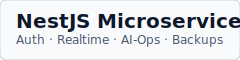
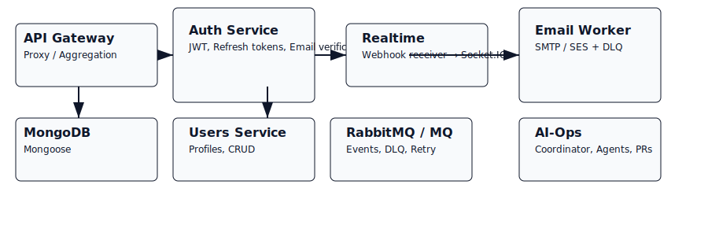
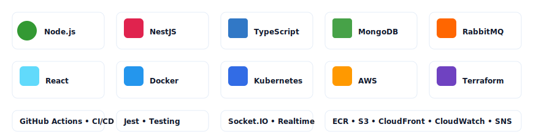

# Project: NestJS Microservices Platform (Auth, Realtime, AI-Ops)

  

  

  

  

A production-focused, extensible microservices platform built with NestJS (TypeScript), MongoDB, RabbitMQ, and a React frontend. This repository contains scaffolding, reference implementations, infrastructure (Terraform), CI/CD workflows, and operational tooling (backup, monitoring, AI-Ops automatic remediation scaffolds).

---

## 🔍 What this project is
- A **microservices reference** for authentication, user management, email delivery, realtime webhook processing, and an AI-Ops coordinator that evaluates and suggests fixes.
- Designed for **scalability, reliability and observability**: messaging with retry/DLQ, CloudWatch metrics & alarms, Docker + EKS deployment, and Terraform infrastructure templates.

## ✅ What's included (high level)
- Backend services (NestJS, TypeScript): `apps/auth`, `apps/users`, `apps/realtime`, `apps/email-worker`, `apps/ai-ops`.
- Frontend: `apps/web` (React, Vite, Redux Toolkit, Zod, Tailwind).
- Messaging: RabbitMQ helpers with retry & DLQ, event-driven patterns.
- Infra scaffolding: `terraform/` (EKS, ECR, Amazon MQ, SNS/SQS/SES, CloudWatch, S3/CloudFront).
- Operational tooling: `scripts/backup-to-s3.sh`, systemd service template, CloudWatch/SNS alarms, k8s manifests, and backup HPA example.
- CI/CD: GitHub Actions workflows; Jenkins pipeline templates available in `.jenkins/`.
- Tests: Jest unit tests for key services and example tests for AI-Ops agents.

---

## 🎯 Achievements & Learnings
- Implemented a **full auth flow** scaffold with JWT access and refresh tokens, hashed refresh support, and email verification hooks.
- Integrated **event-driven email delivery** via a worker that supports SMTP or SES, plus DLQ and retry logic for robustness.
- Built a **realtime pipeline** (webhook ingestion → compute analytics → broadcast via Socket.IO) and a frontend visualizer.
- Designed **AI-Ops coordinator** (multi-agent voting) to evaluate alerts and propose fixes with non-auto-apply safety.
- Added **backup automation** (filesystem + optional Mongo dump + Docker snapshot + S3/ECR integration) with CloudWatch metrics and SNS alerts.
- Gained experience in **Terraform for EKS and AWS services**, CI/CD patterns, and production hardening guidance.

---

## 🚀 Quickstart (local dev)
1. Copy `.env.example` → `.env` and fill required values (do NOT commit secrets).
2. Start local infra: `npm run compose:up` (uses `docker-compose.dev.yml`).
3. Start services (in dev mode): `npm --prefix apps/auth run start:dev`, etc. or use provided compose targets.
4. Frontend: `cd apps/web && npm install && npm run dev`.

Notes: Use `DRY_RUN=1 RUN_ONCE=1 ./scripts/backup-to-s3.sh` to test backup behavior locally.

---

## 🔐 Security & Secrets
- **Never commit secrets.** Use AWS Secrets Manager, SSM Parameter Store, or IRSA for EKS workloads.
- Environment examples are in `.env.example` (placeholders only). Configure CI secrets in GitHub repository settings.
- IAM: apply least-privilege policies for the backup runner, email sender, and ECR push permissions.

---

## 📦 Deployment & Infrastructure
- `terraform/` contains a starting point for VPC, EKS, ECR, Amazon MQ, SNS/SQS/SES, DynamoDB, CloudWatch, S3, and CloudFront.
- `k8s/` contains example manifests (Deployments, Services, HPA) — adapt to your environment and use Helm for templating in production.
- CI: GitHub Actions workflows automate build, tests, and deployment. Ensure protected branches and review rules for Terraform apply.

---

## 🧪 Testing
- Unit tests: run `npm test` at root or per-app (e.g., `cd apps/ai-ops && npm ci && npm test`).
- Add e2e tests (Supertest / Playwright) and socket tests for `realtime` flows; use docker-compose in CI for test DBs.

---

## 🤝 Contributing
Thank you for considering contributing! Please follow these steps:

1. Fork the repository and create a feature branch: `git checkout -b feat/your-feature`.
2. Run tests and linters locally; add tests for new behavior.
3. Open a PR against `main` with a clear description and tests attached.
4. PR checklist:
   - [ ] Tests added/updated
   - [ ] No secrets committed
   - [ ] Documentation updated (if applicable)
   - [ ] CI passes

Suggestions are welcome — report issues or propose features via Issues or PRs.

---

## 📚 How others can use this
- Use this repo as a **reference implementation** for production-ready auth + event-driven services.
- Copy relevant modules (auth, messaging, email worker) into your codebase and adapt config/infra best practices.
- Use `apps/ai-ops` as a starting point for building automated remediation tools — ensure human-in-the-loop approvals for risky changes.

---

## 🧑‍💻 Author
Written by: **Tinkal kumar Full stack Enginner**

If you'd like me to export this README to `.docx` or PDF, or generate a short 'Getting Started' hands-on guide for new contributors, tell me which format you prefer and I will add it.

---

## License
This project is provided as-is for educational and prototyping purposes. Add your preferred license file (e.g., `LICENSE` with MIT) before using in production.
